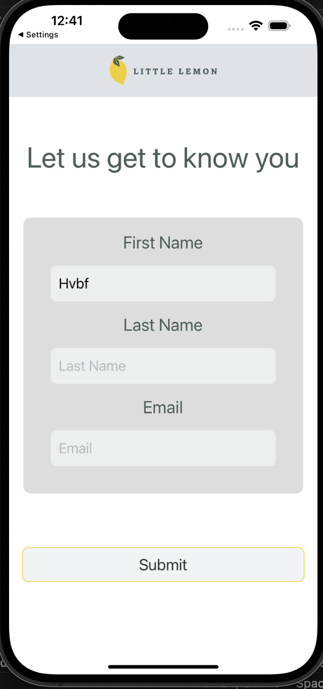
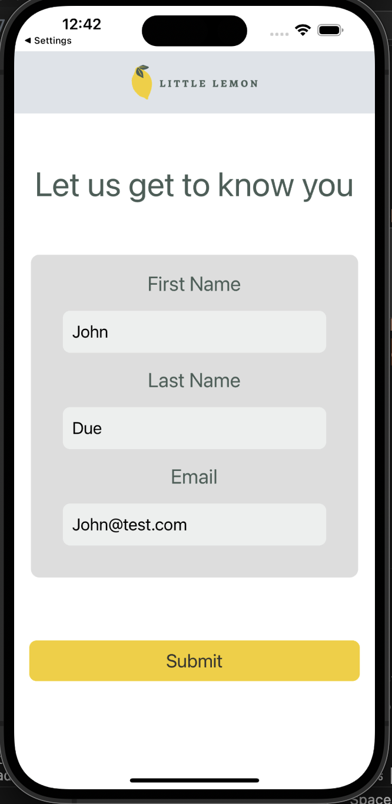
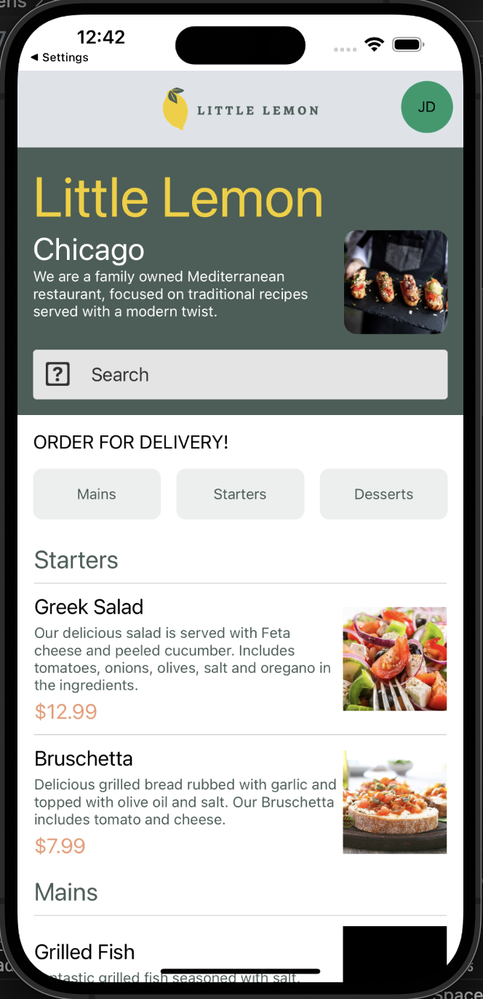
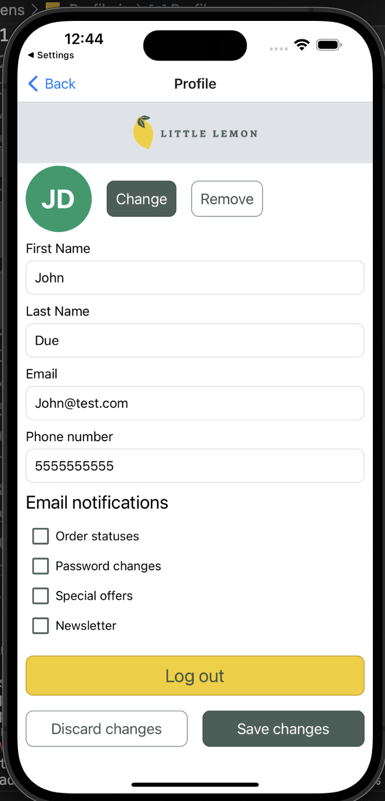

# Little Lemon Food Ordering App

### How to use the project

```
npm install

npm start
```

##### Then, a QR Code wil appear on your terminal.

##### On Android : Scan QR code through Expo Go app.

##### On IOS Scan QR code through Camera app.

### Screenshot









```

```
